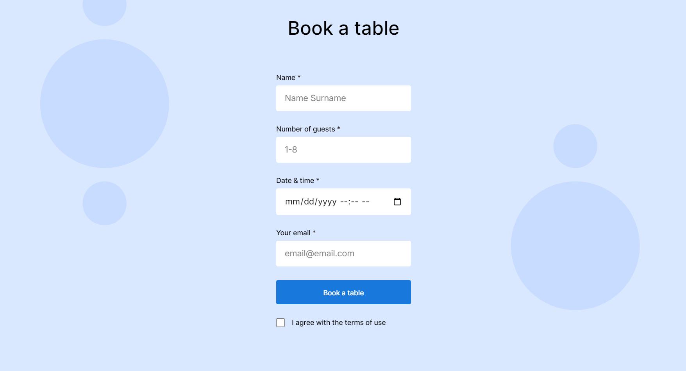

# Triple Peaks Coffee Shop

This is the second project of the Software Engineering program at TripleTen. It was created using HTML and CSS, based on the design brief. BEM Convention abd Flat BEM file structure are used to improve organization and readability.
Flexbox and positioning are used to position elements to the respective design document. A form block is used to allow for potential future receival of and transfer of information from and to clients. CSS animation and transform are used to enhance the users experience by making the website feel alive.

## Project features

- Semantic HTML5
- Flexbox
- Positioning
- Flat BEM file structure
- A custom form
- CSS animation and transform

fig 1. custom form

## Plan on improving the project

add a new blog post page where customers are able post their reviews and see other popular reviews.
the form for writing your own review will be positioned at the top while other
reviews will be placed below the form.
